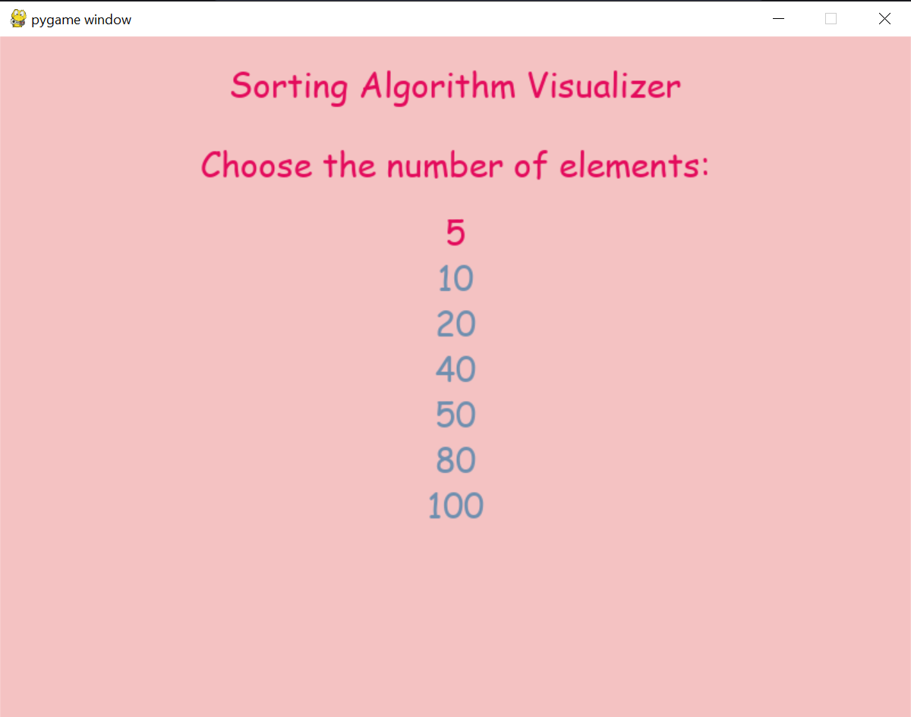
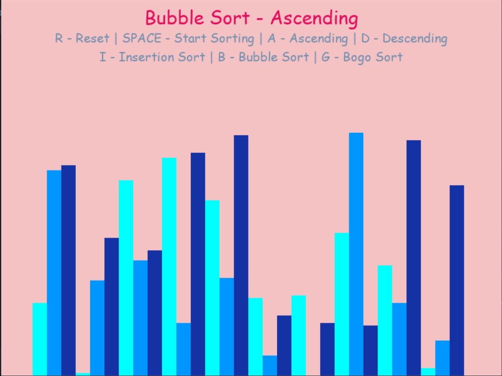
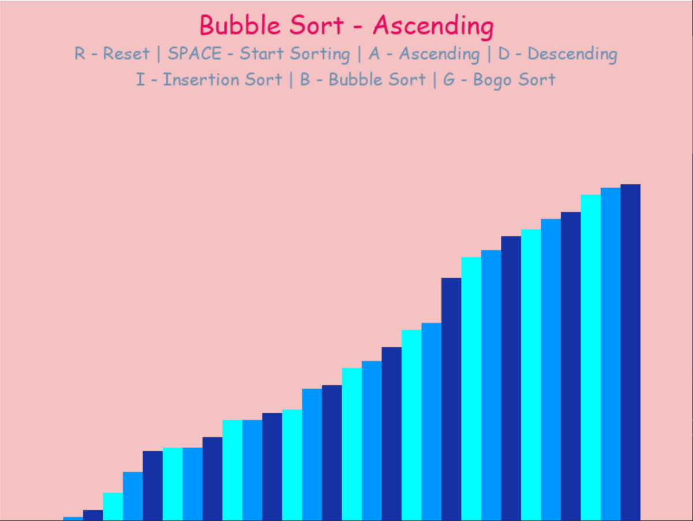
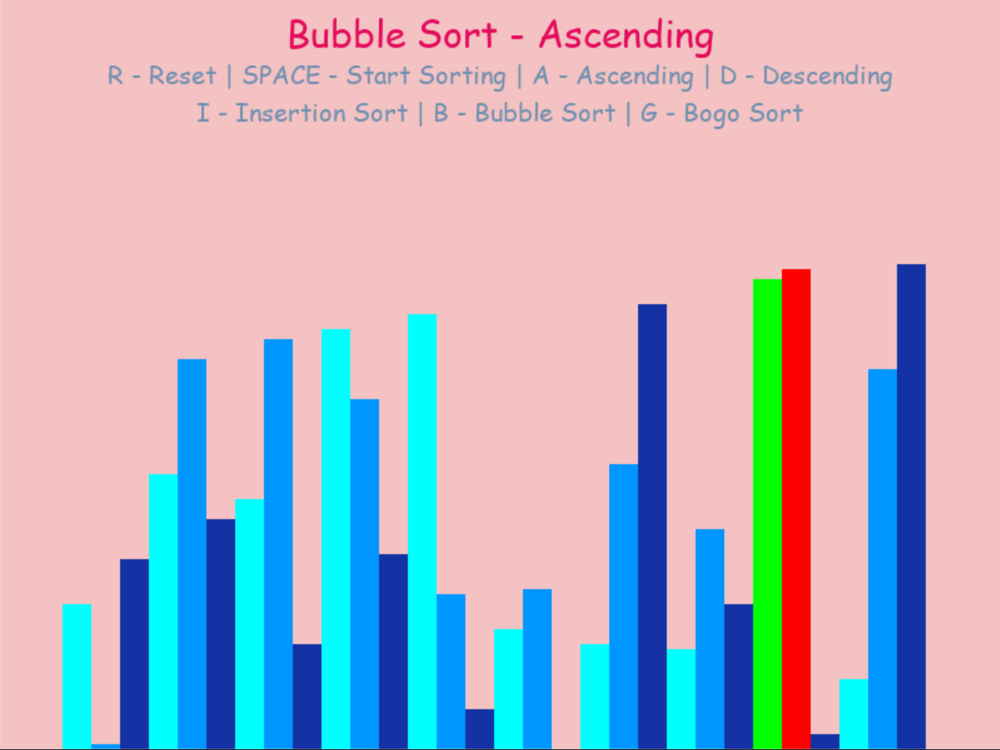
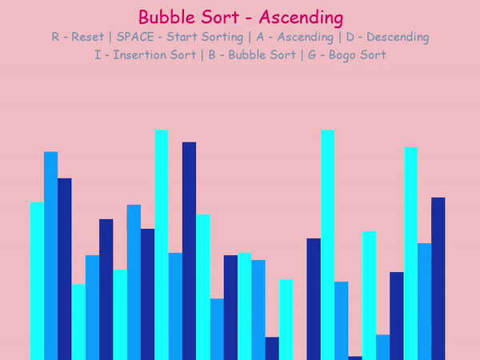

# Sorting Algorithm Visualizer

This project visualizes three sorting algorithms: Bubble Sort, Insertion Sort, and Bogo Sort using Pygame. It allows you to interactively visualize how these algorithms sort a randomly generated list of integers.

## Requirements

- Python 3
- Pygame library

## Installation

1. Clone the repository:
   ```bash
   git clone https://github.com/HabibOmar/sorting-algorithm-visualizer.git
   cd sorting-algorithim-visualizer
### Install dependencies:

```bash
pip install pygame
```

## Usage
Run the main.py file to start the visualization. 

You can use the arrow keys to select number of array elements: 5, 10, 20, 40, 50, 80, 100

Then click **Enter** to go to the visualizing page.

You can control the sorting process with the following keys:

- **R**: Reset the list with new random values.
- **SPACE**: Start sorting using the selected algorithm.
- **A**: Sort in ascending order.
- **D**: Sort in descending order.
- **B**: Select Bubble Sort.
- **I**: Select Insertion Sort.
- **G**: Select Bogo Sort.
## Screenshots and GIFs

### Home Screen


### Initial State


### Final State


### Comparing States


### Sorting Animation


## Acknowledgments
Thanks to Pygame for providing a simple and effective way to create graphical applications in Python.
Inspired by educational resources on sorting algorithms.